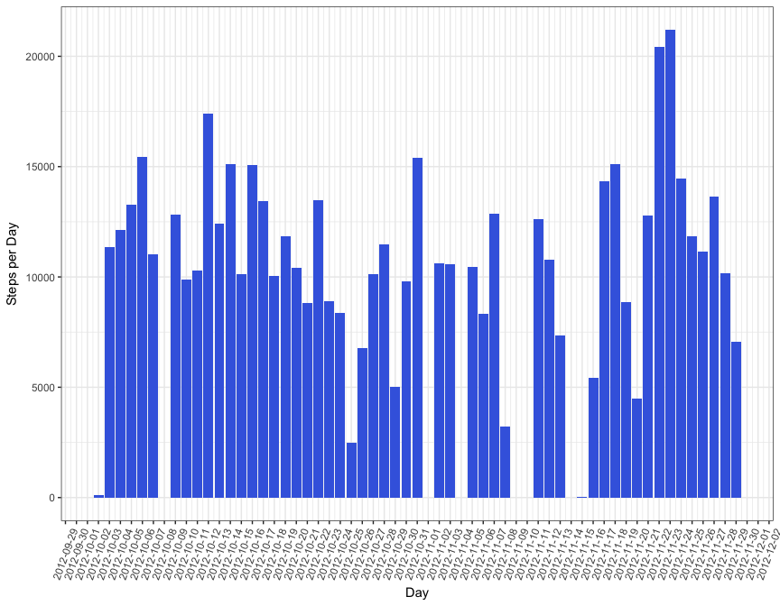
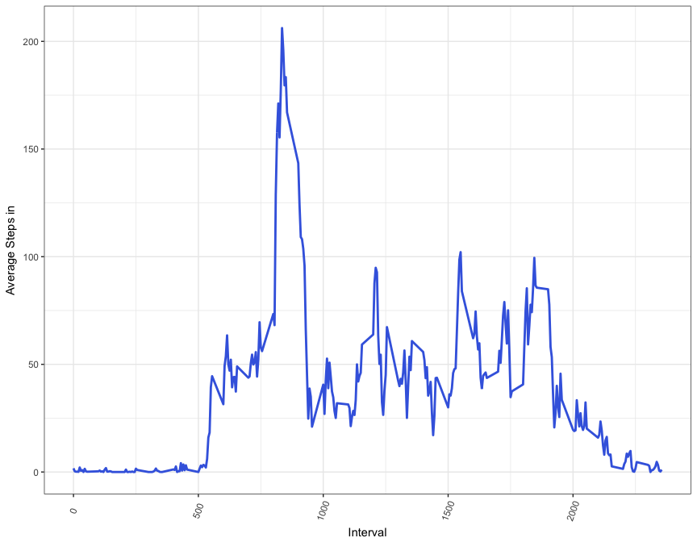
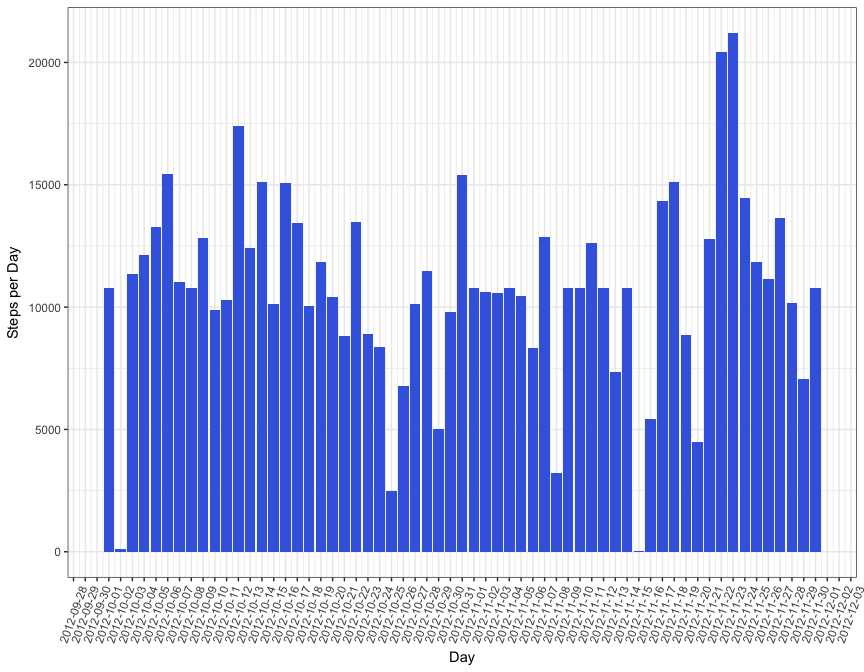

## Loading and preprocessing the data

```r
library(dplyr)
```

```
## 
## Attaching package: 'dplyr'
```

```
## The following objects are masked from 'package:stats':
## 
##     filter, lag
```

```
## The following objects are masked from 'package:base':
## 
##     intersect, setdiff, setequal, union
```

```r
library(scales)
library(ggplot2)
library(lubridate)
```

```
## 
## Attaching package: 'lubridate'
```

```
## The following object is masked from 'package:base':
## 
##     date
```

```r
activity<-read.csv("activity.csv")
str(activity)
```

```
## 'data.frame':	17568 obs. of  3 variables:
##  $ steps   : int  NA NA NA NA NA NA NA NA NA NA ...
##  $ date    : Factor w/ 61 levels "2012-10-01","2012-10-02",..: 1 1 1 1 1 1 1 1 1 1 ...
##  $ interval: int  0 5 10 15 20 25 30 35 40 45 ...
```


```r
StepsPerDay<-data.frame(activity %>%
                    group_by(date) %>%
                        summarise(steps=sum(steps)))
meansteps<-mean(StepsPerDay$steps,na.rm = TRUE)
mediansteps<-median(StepsPerDay$steps,na.rm = TRUE)
```

Below it is shown the total amount of steps taken each day.

```r
g <- ggplot(aes(x=as.Date(date), y=steps), data = StepsPerDay) 
g <- g + geom_histogram(stat = "identity",fill="royalblue")
```

```
## Warning: Ignoring unknown parameters: binwidth, bins, pad
```

```r
g <- g + scale_x_date(date_breaks = "1 day")
g <- g + theme_bw()
g <- g + theme(axis.text.x = element_text(angle = 70, vjust = 0.5))
g <- g + labs(x="Day", y="Steps per Day")
print(g)
```

```
## Warning: Removed 8 rows containing missing values (position_stack).
```

<!-- -->

## What is mean total number of steps taken per day?

To answer this question, we first group the observations in **activity** by interval; we then summarise the created groups and compute the mean of the steps taken in each interval through all days.


```r
AveStepsPerInterval<-data.frame(activity %>%
                            group_by(interval)%>%
                                summarise(average=mean(steps,na.rm = TRUE)))

maxInterval<-AveStepsPerInterval[which.max(AveStepsPerInterval$average),]$interval
```
The average total number of steps taken per day (when data was available) is 1.0766189\times 10^{4}, while the median total number of steps taken per day is 10765.

## What is the average daily activity pattern?

```r
g1 <- ggplot(aes(x=interval, y=average), data = AveStepsPerInterval) 
g1 <- g1 + geom_line(color="royalblue",size=1)
g1 <- g1 + theme_bw()
g1 <- g1 + theme(axis.text.x = element_text(angle = 70, vjust = 0.5))
g1 <- g1 + labs(x="Interval", y="Average Steps in")
print(g1)
```

<!-- -->
At interval 835 the average number of steps taken is maximum.

## Imputing missing values
We are interested in the amount of observations with missing values; let's see how many are these:

```r
novaluessteps<-sum(is.na(activity$steps))
```
There are 2304 observations without a value for the number of steps. We need to fill in these values. To do so, we use the average number of steps taken in the same time interval computed before.Of course, AveStepsPerInterval dataframe has only 288 observations (from the result of the `group_by` command), therefore we will make use of the `%in%`operator to match the **value of interval** in **activitybis** to the **value of interval** in **AveStepsPerInterval**. From now on we will omit the `na.rm=TRUE` option previously used, since we will have filled in the missing values. 


```r
activitybis<-activity
activitybis$steps <- ifelse(is.na(activitybis$steps), AveStepsPerInterval$average[AveStepsPerInterval$interval %in% activity$interval], activitybis$steps) 

StepsPerDayBis <- data.frame(activitybis %>%
                        group_by(date) %>%
                            summarise(steps=sum(steps)))
meanstepsbis<-mean(StepsPerDayBis$steps)
medianstepsbis<-median(StepsPerDayBis$steps)
```
After imputing the missing values, the average total number of steps taken per day (when data was available) is 1.0766189\times 10^{4}, while the median total number of steps taken per day is 1.0766189\times 10^{4}. After imputing the missing values the mean has slightly increased and is now identical to the median.  
Below we show the updated version of the first plot.


```r
gbis <- ggplot(aes(x=as.Date(date), y=steps), data = StepsPerDayBis) 
gbis <- gbis + geom_histogram(stat = "identity",fill="royalblue")
```

```
## Warning: Ignoring unknown parameters: binwidth, bins, pad
```

```r
gbis <- gbis + scale_x_date(date_breaks = "1 day")
gbis <- gbis + theme_bw()
gbis <- gbis + theme(axis.text.x = element_text(angle = 70, vjust = 0.5))
gbis <- gbis + labs(x="Day", y="Steps per Day")
print(gbis)
```

<!-- -->

## Are there differences in activity patterns between weekdays and weekends?
Before answering this question we need to create and add a variable to our dataframe which will represent whether a certain date is a weekend day or a working day.


```r
activitybis$day <- factor(ifelse( weekdays(as.Date(activitybis$date)) %in% c("Saturday", "Sunday"), "weekend", "workday"))
str(activitybis)
```

```
## 'data.frame':	17568 obs. of  4 variables:
##  $ steps   : num  1.717 0.3396 0.1321 0.1509 0.0755 ...
##  $ date    : Factor w/ 61 levels "2012-10-01","2012-10-02",..: 1 1 1 1 1 1 1 1 1 1 ...
##  $ interval: int  0 5 10 15 20 25 30 35 40 45 ...
##  $ day     : Factor w/ 2 levels "weekend","workday": 2 2 2 2 2 2 2 2 2 2 ...
```

We can now answer the last question. To do so, we first group the **activitybis** dataframe by weekday first and interval afterwards; we will then plot the time series of the average steps taken.


```r
AveStepsPerIntervalBis<-data.frame(activitybis %>%
                                group_by(day, interval) %>%
                                    summarise(average=mean(steps)))

g1bis <- ggplot(aes(x=interval, y=average), data = AveStepsPerIntervalBis)
g1bis <- g1bis+geom_line(color="royalblue",size=1)
g1bis <- g1bis+facet_wrap(~ day , ncol = 1)
g1bis <- g1bis+theme_bw()
g1bis <- g1bis + theme(axis.text.x = element_text(angle = 70, vjust = 0.5))
g1bis <- g1bis + labs(x="Interval", y="Average Steps")

print(g1bis)
```

<!-- -->
